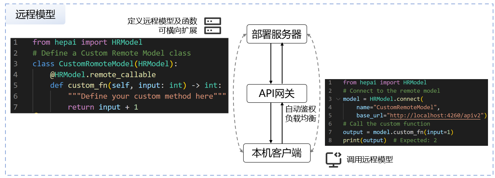
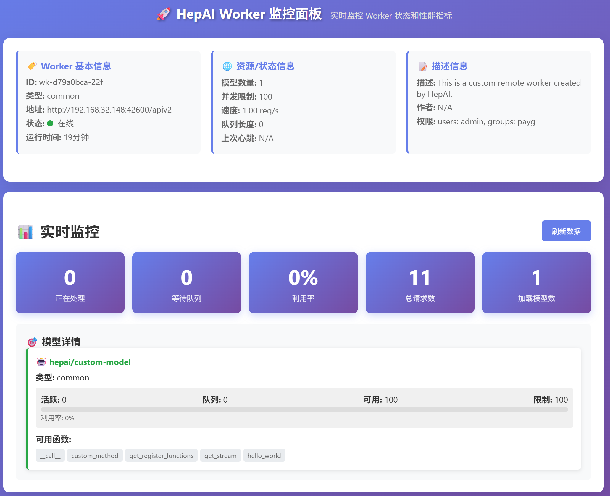
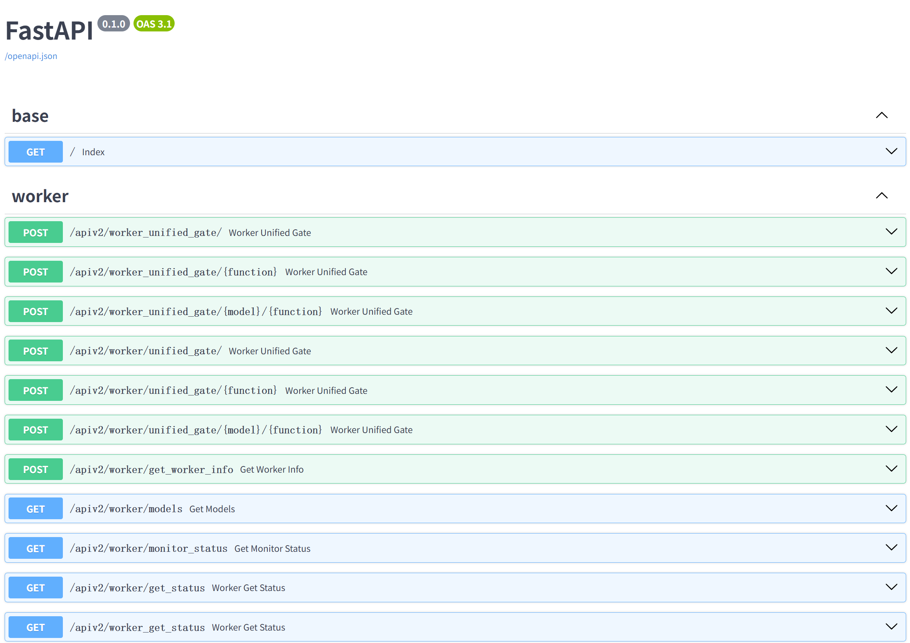

# 远程模型（云模型）
###### 如何将AI模型、数据库、软件程序部署成可通过API访问的云服务？

远程模型（Remote Model），可以将AI模型等任意软件程序搭载到Worker中部署到云端服务器，通过HepAI客户端实现远程模型等低延迟、分布式调用，是高能AI框架的特色功能之一。

<div style="text-align: center;">
    
</div>


## 1 快速开始

需要`hepai>=1.2.8`, 通过`pip install hepai --upgrade`安装。

#### 1.1 启动远程模型

（1） 创建程序`simple_remote_model.py`:
```python
from hepai import HRModel  # Import the HRModel class from the hepai package.

class SimpleWorkerModel(HRModel):  # Define a custom worker model inheriting from HRModel.
    def __init__(self, name: str = "hepai/simple-model", **kwargs):
        super().__init__(name=name, **kwargs)

    @HRModel.remote_callable  # Decorate the function to enable remote call.
    def simple_method(self, a: int = 1, b: int = 2) -> int:
        """Define your custom method here."""
        return a + b

if __name__ == "__main__":
    SimpleWorkerModel.run()  # Run the custom worker model.
```

（2） 运行`python simple_remote_model.py`以启动模型。运行`python simple_remote_model.py -h`可查看启动参数。
（3） 启动后，可打开[http://localhost:42600](http://localhost:42600)查看Worker监控面板。

##### 要点说明：
- 远程模型需要继承`HRModel`类，并通过`@HRModel.remote_callable`装饰器标记可远程调用的方法。
- 远程模型通过`SimpleWorkerModel.run()`启动，默认监听`42600`端口。
- 远程模型的名称通过`name`参数设置，默认为`hepai/simple-model`。

#### 1.2 调用远程模型

（1）新建一个终端，创建程序`simple_client.py`：
```python
from hepai import HepAI, RemoteModel

model: RemoteModel = HepAI(base_url="http://localhost:42600/apiv2"
                           ).connect_to("hepai/simple-model")

print(model.worker_info)  # Get worker info.
print(model.functions)  # Get all remote callable functions.
print(model.function_details)  # Get all remote callable function details.

output = model.simple_method(a=1, b=2)
print(f"output: {output}")
```
（2）运行`python simple_client.py`调用远程模型，输出结果为`output: 3`。

##### 要点说明：
- 通过`HepAI(base_url=...)`创建客户端实例，`base_url`为远程模型所在服务器地址。
- 通过`connect_to("model_name")`连接远程模型，`model_name`为远程模型的名称。
- 通过`model.custom_method(...)`调用远程模型的方法，函数名、入参、返回值均与远程模型定义一致。


## 2 完整代码示例

#### 2.1 远程模型代码

(1) 创建程序`custom_remote_model.py`:

```python
from typing import Dict, Union, Literal
from dataclasses import dataclass, field
import json
import hepai
from hepai import HRModel, HModelConfig, HWorkerConfig, HWorkerAPP

@dataclass  # (1) model config
class CustomModelConfig(HModelConfig):
    name: str = field(default="hepai/custom-model", metadata={"help": "Model's name"})
    permission: Union[str, Dict] = field(default=None, metadata={"help": "Model's permission, separated by ;, e.g., 'groups: all; users: a, b; owner: c', will inherit from worker permissions if not setted"})
    version: str = field(default="2.0", metadata={"help": "Model's version"})

@dataclass  # (2) worker config
class CustomWorkerConfig(HWorkerConfig):
    # config for worker server
    host: str = field(default="0.0.0.0", metadata={"help": "Worker's address, enable to access from outside if set to `0.0.0.0`, otherwise only localhost can access"})
    port: int = field(default=42600, metadata={"help": "Worker's port, default is 42600"})
    auto_start_port: int = field(default=42602, metadata={"help": "Worker's start port, only used when port is set to `None`"})
    type: Literal["common", "llm", "actuator", "preceptor", "memory"] = field(default="common", metadata={"help": "Specify worker type, could be help in some cases"})
    speed: int = field(default=1, metadata={"help": "Model's speed"})
    limit_model_concurrency: int = field(default=100, metadata={"help": "Limit the model's concurrency"})
    permissions: str = field(default='users: admin;groups: payg', metadata={"help": "Worker's permissions, separated by ;, e.g., 'groups: default; users: a, b; owner: c'"})
    author: str = field(default=None, metadata={"help": "Model's author"})
    description: str = field(default='This is a custom remote worker created by HepAI.', metadata={"help": "Model's description"})
    
    # config for controller connection
    controller_address: str = field(default="https://aiapi.ihep.ac.cn", metadata={"help": "Controller's address"})
    no_register: bool = field(default=True, metadata={"help": "Do not register to controller"})

class CustomWorkerModel(HRModel):  # Define a custom worker model inheriting from HRModel.
    def __init__(self, config: HModelConfig):
        super().__init__(config=config)

    @HRModel.remote_callable  # Decorate the function to enable remote call.
    def custom_method(self, a: int = 1, b: int = 2) -> int:
        """Define your custom method here."""
        return a + b
    
    @HRModel.remote_callable
    def get_stream(self):
        for x in range(10):
            yield f"data: {json.dumps(x)}\n\n"
            
if __name__ == "__main__":

    import uvicorn
    from fastapi import FastAPI
    model_config, worker_config = hepai.parse_args((CustomModelConfig, CustomWorkerConfig))
    model = CustomWorkerModel(model_config)  # Instantiate the custom worker model.
    app: FastAPI = HWorkerAPP(models=[model], worker_config=worker_config)  # Instantiate the APP, which is a FastAPI application.
    
    print(app.worker.get_worker_info(), flush=True)
    # 启动服务  
    uvicorn.run(app, host=app.host, port=app.port)
```

(2) 运行`python custom_remote_model.py`以启动模型。运行`python custom_remote_model.py -h`可查看启动参数。

重要参数说明：
- `HModelConfig`：用于配置模型的参数，如`name`（模型名称）、`permission`（模型访问权限）、`version`（模型版本）等。
- `HWorkerConfig`：用于配置Worker的参数，如`host`（Worker地址）、`port`（Worker端口号）、`permissions`（Worker访问权限）、`controller_address`（控制器地址）等。


##### 要点说明：
- 本质上，HepAI远程模型是被FastAPI框架封装的API服务，实践中通过`HWorkerAPP`类创建FastAPI应用。一个Worker可以搭载多个模型，只需在`HWorkerAPP`中传入多个模型实例即可。
- 由于采用了`hepai.parse_args()`解析参数，因此可以通过命令行参数设置模型和Worker的参数，如`python custom_remote_model.py --port None`。

#### 2.2 客户端代码

(1) 创建程序`custom_client.py`:

```python
from hepai import HepAI, RemoteModel

model: RemoteModel = HepAI(base_url="http://localhost:42600/apiv2"
                           ).connect_to("hepai/custom-model")

# Call the `custom_method` of the remote model.
output = model.custom_method(a=1, b=2)
print(f"output: {output}")

# call the `get_stream` of the remote model.
stream = model.get_stream(stream=True)  # Note: You should set `stream=True` additionally.
print(f"Output of get_stream:")
for x in stream:
    print(f"{x}, type: {type(x)}", flush=True)
```
(2) 运行`python custom_client.py`调用远程模型。
- 示例中调用`custom_method`输出结果为
```bash
output: 3
```
- 调用`get_stream`方法，输出结果为：
```bash
Output of get_stream:
0, type: <class 'int'>
1, type: <class 'int'>
2, type: <class 'int'>
3, type: <class 'int'>
4, type: <class 'int'>
5, type: <class 'int'>
6, type: <class 'int'>
7, type: <class 'int'>
8, type: <class 'int'>
9, type: <class 'int'>
```

#### 要点说明：
##### (1) **如何实现流式输出？** 
远程模型实现流式输出需满足SSE(Server-Sent Events)格式，即每次输出的数据以`data: `开头，以`\n\n`结尾，正文内容用`json.dumps()`转换为json字符串，例如：

```python
class CustomWorkerModel(HRModel):
    @HRModel.remote_callable
    def get_stream(self):
        for x in range(10):
            yield f"data: {json.dumps(x)}\n\n"
```
- `yield`返回Generator对象，正文内容`x`可以是任意python基础类型，不能是python对象，HepAI会服务端会自动编码，客户端自动解码为原始数据和对应类型，最佳实践为Dict。
- 客户端请求时，需额外设置`stream=True`保留参数，如`model.get_stream(stream=True)`。

##### (2) 单worker搭载多模型

只需在`HWorkerAPP`中传入多个模型实例即可。

```python
from hepai import HRModel, HWorkerAPP

model1 = HRModel("hepai/hr-model1")
model2 = HRModel("hepai/hr-model2")
app = HWorkerAPP(models=[model1, model2])
app.run()  # Run the APP.
```

#### (3) 设置模型的访问权限

+ `HModelConfig`中的`permission`参数用于设置模型的访问权限，如`permission="groups: default; users: a, b; owner: c"`，表示只有`default`用户组的用户和`a`、`b`用户可以访问该模型，`c`用户为模型的所有者。
+ `HWorkerConfig`中的`permissions`参数用于设置Worker的访问权限。

+ 一个worker可以搭载多个模型，每个模型可以设置不同的访问权限。如果模型没有设置访问权限，则会继承Worker的访问权限。

#### (4) 分布式和多模型负载均衡

+ 多Worker分别部署到不同的服务器上，搭配HepAI统一网关控制器可以实现分布式部署和自动负载均衡。
+ HepAI网关控制器地址为`https://aiapi.ihep.ac.cn`。
+ 通过`HWorkerConfig`设置`Controller`参数，如`controller="https://aiapi.ihep.ac.cn"`，并设置`no-register=False`，则Worker会自动注册到控制器。
+ 客户端访问时，设置`base_url`为控制器地址，如`base_url="https://aiapi.ihep.ac.cn/apiv2"`，控制器会自动转发请求到对应的Worker及对应的模型。

## 3 Worker监控和API接口

##### （1）Worker监控面板
启动远程模型后，可通过浏览器访问`http://<worker_host>:<worker_port>`查看Worker监控面板，默认远程模型启动的地址端口号为`42600`，则访问
[http://localhost:42600](http://localhost:42600)可查看Worker监控面板。

<div style="text-align: center;">
    
</div>

- 注：若注册到HepAI控制器，则可通过控制器查看所有注册的Worker和模型，地址为[https://aiapi.ihep.ac.cn/#/worker-cards](https://aiapi.ihep.ac.cn/#/worker-cards)。

##### (2) API接口
通过浏览器访问`http://<worker_host>:<worker_port>/docs`
查看Worker的API接口文档，默认远程模型启动的地址端口号为`42600`，则访问
[http://localhost:42600/docs](http://localhost:42600/docs)可查看API接口文档。

<div style="text-align: center;">
    
</div>


## 4 Q&A:
- **Q**: 如何设置远程模型的访问权限？
- **A**: 通过`HModelConfig`中的`permission`参数设置模型的访问权限，如`permission="groups: default; users: a, b; owner: c"`。
- **Q**: 如何查看远程模型的API接口？
- **A**: 通过浏览器访问`http://<worker_host>:<worker_port>/apiv2`。
- **Q**: 如何设置和自动设置Worker的端口号？
- **A**: 通过`HWorkerConfig`中的`port`参数设置Worker的端口号，若设置为`None`，则会从`auto_start_port`开始自动分配端口号。
- **Q**: 如何实现远程模型的流式输出？
- **A**: 通过在远程模型的方法中使用`yield`返回Generator对象，并确保每次输出的数据符合SSE格式，即以`data: `开头，以`\n\n`结尾，正文内容用`json.dumps()`转换为json字符串。
- **Q**: 如何在一个Worker中搭载多个远程模型？
- **A**: 在创建`HWorkerAPP`实例时，传入多个模型实例的列表，如`HWorkerAPP(models=[model1, model2])`。
- **Q**: 如何实现分布式部署和负载均衡？
- **A**: 通过搭配HepAI统一网关控制器，Worker注册到控制器，客户端访问控制器地址，控制器会自动转发请求到对应的Worker及模型。